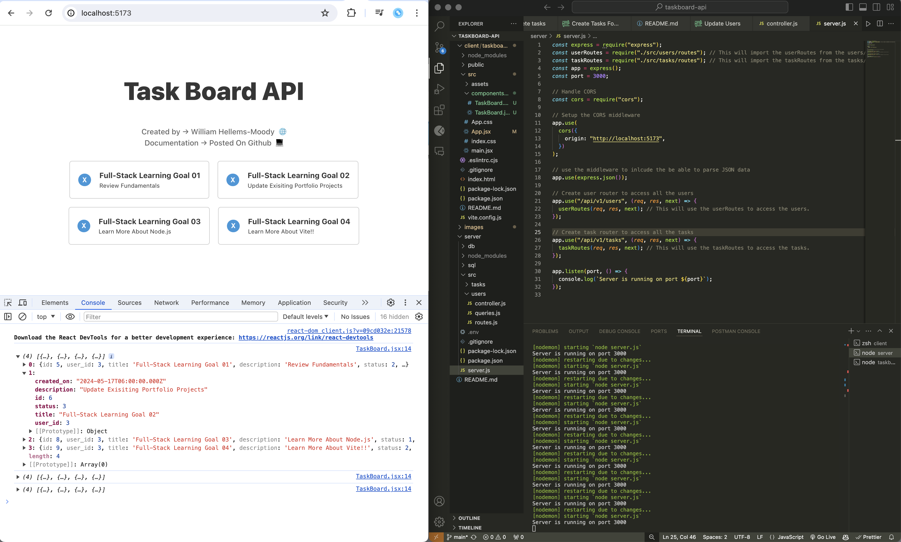

# Taskboard API + Frontend UI (Currently Updating)

Taskboard is a RESTful API designed to empower users to create, manage, and delete tasks stored in a database. It supports password updates and encryption using the Bcrypt npm package, providing robust user authentication. This project was an immersive exploration into password hashing and tracking using Node.js while honing skills in constructing RESTful APIs. Additionally, it involves integrating a frontend UI using Vite and React.js for a seamless user experience, encompassing secure authentication. The project also utilizes Docker for containerization, ensuring a consistent development and deployment environment.

# Installation | Setup

## Dependencies

- Node.js
- Express.js
- nodemon (Run `sudo npm install nodemon`) - This is required to run the server
- pg (PostgresSQL) (Run `sudo npm install pg`) - This is required to connect to the PostgresSQL database
- dotenv
- bcrypt (Run `sudo npm install bcrypt`) - This is required to hash the password
- cors (Run `sudo npm install cors`) - This is required to allow CORS
  requests

### Tech Stack

- Node.js
- Express.js
- Postgres
- Vite + React.js
- Docker

### Node.js Setup

The following command will create a `package.json` file in the root directory of `/server`, that will be used to install the required dependencies.

```bash
npm init -y
```

### Express

The following express package is required to create the server. It will also be used to handle the routes and requests when communicating with the database.

```bash
npm install express
```

### Nodemon

Nodemon is a utility package that will monitor for any changes in the source code and automatically restart the server.

```bash
npm install nodemon
```

### PostgresSQL

The following package is required to connect to the PostgresSQL database, for performing CRUD operations.

```bash
npm install pg
```

### Dotenv

The following package is required to load environment variables from a `.env` file into `process.env`.

```bash
npm install dotenv
```

# Docker Container Setup

Create a (local) folder to store the Postgres data files. For example, I created a folder called `postgres` in my documents folder. The absolute path to the folder is:

### Path to Docker Folder

```
/Users/williamhellemsmoody/Documents/docker_d
```

### Running Postgres Container

Download the postgres (standard) docker image from Docker hub using:

```
docker pull postgres
```

Then start your postgres container from the image that you downloaded using:

```
docker run --rm --name postgres --publish 5432:5432 -e POSTGRES_PASSWORD=<PG_PASS> -v /Users/<USER_DIR>/Documents/docker_db:/var/lib/postgresql/data postgres
```

The command above will start postgres using **1234** as the password for the postgres (default) user. Note the use of -e parameter (useful to set environment variables) for your container. The environment variables that need to be set are container-dependent. Please note that the **-v** parameter which allows mapping the container's postgres storage to a localq folder of your choice. Of course, you need to replace the absolute path to match your own environment. If postgres successfully started, the following log message will appear:

```sql
LOG: database system is ready to accept connections
```

# Starting the PSQL Session

On another terminal window, use **docker exec** to start **psql** session to connect with the DBMS.

```sql
docker exec -it postgres psql -U postgres
```

- If the command above is successful, you should be able to see **psql** prompt:

```sql
psql (16.2 (Debian 16.2-1.pgdg120+2))
Type "help" for help.

postgres=#
```

# Database Setup

Use the following queries to create a database and table in the PostgresSQL database.

```sql
-- Create the database
CREATE DATABASE taskdb;

-- Connect to the database
\c taskdb;

-- Create the users table
CREATE TABLE users (
    id SERIAL PRIMARY KEY, -- Auto-incrementing ID
    username VARCHAR(50) NOT NULL UNIQUE, -- Ensure the username is unique
    password VARCHAR(255) NOT NULL,
    email VARCHAR(50) NOT NULL,
    created_on DATE DEFAULT CURRENT_DATE NOT NULL
);

-- Insert user data
INSERT INTO users (username, password, email) VALUES
('user1', 'password1', 'user1@example.com');

-- Create the status table
CREATE TABLE status (
    id INT PRIMARY KEY,
    name VARCHAR(50) NOT NULL
);

-- Insert status data
INSERT INTO status (id, name) VALUES
(1, 'Pending'),
(2, 'In Progress'),
(3, 'Completed');

-- Create the tasks table
CREATE TABLE tasks (
    id SERIAL PRIMARY KEY,
    user_id INT NOT NULL,
    title VARCHAR(50) NOT NULL,
    description TEXT NOT NULL,
    status INT NOT NULL,
    created_on DATE DEFAULT CURRENT_DATE,
    FOREIGN KEY (user_id) REFERENCES users(id) ON DELETE CASCADE,
    FOREIGN KEY (status) REFERENCES status(id)
);

-- Insert task data into the tasks table
INSERT INTO tasks (user_id, title, description, status) VALUES
(1, 'Complete Profile', 'Update your profile with additional details', 1);
```

---

# Get Server Up and Running Server (Backend)

1. Clone the repository
2. Run `npm install` to install all the dependencies
3. Create a `.env` file in the root directory and add the following
   environment variables:
   - `DB_USER`
   - `DB_PASSWORD`
   - `DB_HOST`
   - `DB_PORT`
   - `DB_DATABASE`
4. Run `npm run dev` to start the server

## API Endpoints

### Tasks Enpoints (CRUD)

This can be tested in Postman or using the UI or within the Postman extension in VS Code.

- GET `/tasks` - Get all tasks
- GET `/tasks/:id` - Get a task by id
- POST `/tasks` - Create a new task
- PUT `/tasks/:id` - Update a task by id
- DELETE `/tasks/:id` - Delete a task by id

Sample Task Requests Object:

```json
[
  {
    "id": 4,
    "user_id": 3,
    "title": "Tasks for user 02",
    "description": "print shipping labels for 200+ orders.",
    "status": 2,
    "created_on": "2024-05-17T06:00:00.000Z"
  }
]
```

### User Enpoints

- GET `/users` - Get all users
- GET `/users/:id` - Get a user by id
- POST `/users` - Create a new user
- PUT `/users/:id` - Update a user by id
- DELETE `/users/:id` - Delete a user by id

Sample GET Requests for User Object:

```json
[
  {
    "id": 3,
    "username": "admin_user02",
    "password": "$2b$10$1iD1mXRiRQ5holmCqmnxfutZp5WyXecUsgazW.A68VJxIrpDt0umy",
    "email": "admin02@example.com",
    "created_on": "2024-05-16T06:00:00.000Z",
    "last_login": "2024-05-16T06:00:00.000Z"
  }
]
```

## Testing Login Functionality

#### Login User

Can test the login functionality by sending a POST request to /login with the user's email and password in the body. If the provided password matches the stored hashed password, it will return a success message; otherwise, it will return an error.

```bash
curl -X POST http://localhost:3000/login -H "Content-Type: application/json" -d '
{
   "email":"user1@example.com",
   "password":"password1"
}
'
```

#### Update Password

Can test the password update functionality by sending a PUT request to /update-password with the user's email and the new password in the body

Body:

```bash
curl -X PUT http://localhost:3000/update-password -H "Content-Type: application/json" -d '
{
   "email":"user1@example.com",
   "password":"newpassword1"
}
'
```

Ouput:

```curl
{
"email": "admin02@example.com",
"password": "$2b$10$MLOEiVtUyBaBBe3NvCPdWOaKbIEL6XwqScE0Jk.yIuyE6SZdo2q12"
}

```

---

# Client Side Integration using Vite + React.js (Frontend)

The client side of the project is being developed using Vite + React.js. The client side will be integrated with the API to provide a seamless user experience.

### Installation

1. Navigate to the `client` directory

Install Vite using the following command:

```bash
npm create vite@latest taskboard-ui -- --template react
```

Vite Documentation:

- [Vite Documentation](https://vitejs.dev/guide/)

2. Run `npm install` to install all the dependencies will need to be executed in the client directory

3. Run `npm run dev` to start the server to run the client side application on `localhost:3000`

# Components

## Taskboard.jsx:

GOAL(s):

- User Story:

  - As a user, I want to be able to view all the tasks that are stored in the database.
  - As a user, I want to be able to create a new task.
  - As a user, I want to be able to update a task.
  - As a user, I want to be able to delete a task.

This component will contain the main component that will be used to display the tasks. It will display each task located in the relational database tied to a specific user. It will allow the user to create, update, and delete tasks.

Example of CORS Error:


Fix: Add the following code to the `server.js` file to allow CORS requests and make sure the correct headers and dependencies are installed.

```bash
npm install cors
```

### server.js [Updated]

- If not already added, add the following code to the `server.js` file to allow CORS requests to be made from the client side for your local development environment.

```bash
// Handle CORS
const cors = require("cors");

// Setup the CORS middleware
app.use(
  cors({
    origin: "http://localhost:5173",
  })
);
```

Example of Vite Local Enviornment:


- If successful, you should see the following output in the terminal:

  - The output will display the tasks that are stored in the relational PSQL database.



The output will display the tasks that are stored on the relational PSQL database, where the user is able to query the tasks, create a new task, update a task, and delete a task.

## Functionality (GET, DELETE, POST, PUT)

- The user is able to view all the tasks that are stored in the database.

Handlers.js - Allows us to call the API to get all the tasks stored in the database.

GET and DELETE handler functions:

```bash

   // GET /api/v1/tasks
   const handleFetchTasks = async () => {
      try {
         const response = await fetch("http://localhost:3000/api/v1/tasks");
         if (!response.ok) {
            throw new Error("Failed to fetch tasks");
         }
         const data = await response.json();
         return data;
      } catch (error) {
         console.error("Error fetching tasks:", error);
         return [];
      }
   };

   // DELETE /api/v1/tasks/:id
   const handleDeleteTask = async (id) => {
      try {
         const response = await fetch(`http://localhost:3000/api/v1/tasks/${id}`, {
            method: "DELETE",
         });
         if (!response.ok) {
            throw new Error("Failed to delete task");
         }
         // Return id if response is empty or not JSON
         try {
            const data = await response.json();
            return data;
         } catch (jsonError) {
            return { id }; // Assuming the task ID is enough to filter it out from the list
         }
      } catch (error) {
         console.error("Error deleting task:", error);
      }
   };
```

### Integration into the Taskboard Component UI

Each function is imported into the Taskboard component and used to display the tasks, create a new task, update a task, and delete a task.

```javascript
// Import API handlers
import {
  handleFetchTasks,
  handleCreateTask,
  handleDeleteTask,
} from "../../handlers/api";
```

#### Taskboard Component

```javascript
// State to store tasks
const [tasks, setTasks] = useState([]);

// Fetch tasks from the server
useEffect(() => {
  const fetchTasks = async () => {
    const data = await handleFetchTasks();
    setTasks(data);
    console.log(data);
  };
  fetchTasks();
}, []);

// Delete a task
const deleteTask = async (id) => {
  await handleDeleteTask(id);
  setTasks(tasks.filter((task) => task.id !== id));
};
```

## Test Frontend UI Functionality

- The frontend UI is currently being developed and will be integrated with the API to provide the user the ability to currently view, and delete tasks stored in the database in real-time.


# NOTE: Additional functionality is currently being added to the project.
